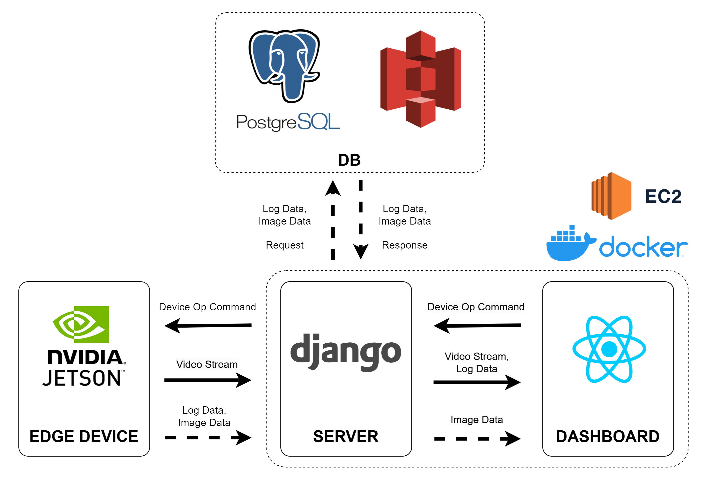

# 🌧 OKDK: AI 기반 빗물받이 관리 시스템
 

## 📋 프로젝트 개요
OKDK 프로젝트는 **AI 기반의 빗물받이 관리 시스템📡** 을 개발하여 집중호우로 인한 침수 피해를 예방하는 것을 목표로 합니다.    

이 시스템은 **자율주행 및 객체 인식 AI가 적용된 엣지 디바이스🤖** 와 **사용자가 이를 제어할 수 있는 대시보드🖥️** 로 구성되어 있습니다.  
 
  
## 🚨 프로젝트 배경
2022년 8월, 기록적인 폭우(시간당 351mm)로 인해 전국적으로 **21명의 인명 피해**와 **3,155억 원의 재산 피해**가 발생하였습니다.  
그러나 2024년 이후에도 **빗물받이 관리의 미흡**으로 인해 **침수 피해 위험**이 지속되고 있습니다.

- 서울시 내 약 **55만 개의 빗물받이**를 사람이 직접 점검 및 청소하는 현재의 방식은 **비효율적**입니다.
- 빗물받이 내부의 **이물질이 배수를 방해**하여 침수 피해를 유발합니다.
- 효과적인 **모니터링 시스템이 부재**하여 실시간 점검이 어렵습니다.  
 

## 🎯 프로젝트 목표
OKDK 프로젝트는 다음과 같은 목표를 가집니다:

1. **자율주행 및 객체 인식 AI가 적용된 엣지 디바이스 개발**  
   - 빗물받이의 상태를 자동으로 모니터링하고 점검합니다.
   
2. **사용자 제어 대시보드 구축**  
   - 사용자가 원격으로 엣지 디바이스를 제어하고 실시간으로 상태를 확인할 수 있습니다.
   
3. **빗물받이 모니터링 자동화 및 관리 비용 절감**  
   - 자동화된 시스템을 통해 관리 효율성을 높이고 비용을 절감합니다.  
 

## 🚀 프로젝트 경쟁력
- **AI 기반 자동 모니터링 및 점검**  
  - 기존 수작업 대비 빠르고 정확한 빗물받이 관리가 가능하며, 관리 비용 절감과 인력 운용 효율성을 극대화합니다.
  
- **높은 확장성**  
  - 하나의 대시보드에 여러 개의 엣지 디바이스를 연결하여 넓은 지역을 효율적으로 관리할 수 있습니다.
  
- **데이터 기반 의사결정 지원**  
  - 빗물받이 막힘 빈도, 배수 성능, 강우량과의 상관관계를 분석하여 침수 예측 모델을 구축하고 사전 대응 역량을 강화합니다.
  
- **스마트 시티 연계 가능성**  
  - 도로 배수 및 하수 시스템 관리 등 다양한 인프라 최적화에 활용 가능하며, 도시 관리 시스템과 통합하여 재난 대응 능력을 향상시킬 수 있습니다.  
 

## 🛠 시스템 아키텍처 및 기술스택
본 프로젝트는 **프론트엔드(FE)**, **백엔드(BE)**, **하드웨어(HW)** 로 구성됩니다.

### 기술 스택
- **프론트엔드**: React 18.2.0
- **백엔드**: Django 4.2.18, PostgreSQL 17.2, AWS S3
- **하드웨어**: Jetson Nano, JetPack 5.1.3, Python 3.8.7, PyTorch 2.1.0
- **AI 모델**: ResNet18, YOLOv8, MobileNetv2
- **배포**: AWS EC2, Docker

  
   
 

## 🔔 기능 목록

### 🖥️ 프론트엔드(FE)
- 회원 가입 및 로그인/로그아웃 기능
- 지도 시각화 (Mapbox API 연동)
- 날씨 예보 (기상청 API 연동)
- 실시간 알림 기능
- 빗물받이 배치 구역 선택
- 실시간 카메라 스트리밍
- 빗물받이 촬영 이미지 출력
- 빗물받이 판별 로그 출력
  
### 💾 백엔드(BE)
- 회원정보 저장 및 관리
- 외부 API 데이터 저장 및 송신
- 실시간 알림 전송
- 디바이스 구동 명령 송신
- 디바이스 카메라 영상 수신 및 전송
- 빗물받이 이미지 수신 및 저장
- 빗물받이 로그 데이터 수신 및 저장

### ⚙️ 하드웨어(HW)
- 자율주행 기능
- 빗물받이 감지 및 상태 판별
- 구동 명령 수신 및 처리
- 카메라 영상 전송 및 빗물받이 이미지 분석
- 빗물받이 판별 결과 전송

 

## 🌟 기대 효과
- **빗물받이 점검 자동화**를 통한 인건비 절감
- **실시간 모니터링**을 통한 즉각적인 침수 대응 가능
- **도시 인프라 최적화** 및 **스마트 시티** 연계 가능  
 

## 👥 팀 구성
- **프론트엔드 개발자**: 이예진, 김아현
- **백엔드 개발자**: 한진우
- **하드웨어 엔지니어**: 심준보, 한상훈
- **AI 엔지니어**: 박철진  

 

## 🌐 외부 API  
- **서울시 침수심데이터**
- **기상청 단기예보**
- **Mapbox**  

 

## 🔗 프로젝트 관련 링크
[요구사항명세](https://www.notion.so/OKDK-197cc7fb32f880509fcbc27a59530754#19acc7fb32f8806d86afd6be33e6a76c)
   
[와이어프레임](https://www.figma.com/design/Qe1E02elnrhD7FikM92Rix/OKDK?node-id=0-1&p=f&t=9ZyDI7eOfRiW41Fe-0)  

[ERD](https://www.notion.so/ERD-19ecc7fb32f880baa93fc9634417ffed)  

[API명세](https://www.notion.so/API-19ecc7fb32f8800f9231e3bcd99e13dc)  

[JIRA](https://ssafy.atlassian.net/jira/software/c/projects/S12P11A204/boards/7752)  

 

---

본 프로젝트의 저작권은 **삼성 청년 SW 아카데미**에 있습니다.  
 
