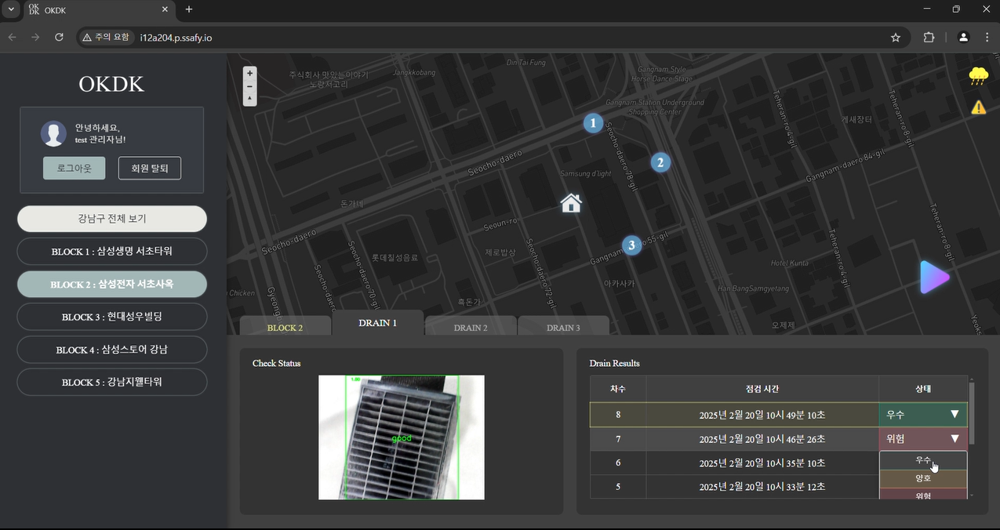

# **배수구 로봇 제어 시연 절차**

해당 문서는 배수구 로봇을 컨트롤하는 서버의 시연 절차를 단계적으로 설명하고 있습니다.

---

## **1. 서버 실행 및 접속**
1. 서버에서 서비스가 실행된 상태에서 아래 URL에 접속합니다.
   ```
   http://your-server-url
   ```
2. **관리자 계정으로 로그인**
   - **ID**: `test`
   - **Password**: `qwer1234`

   

3. 로그인 성공 후 메인 화면이 나타납니다.
   

### 1-1. 로그 아웃
1. 로그아웃 시, 화면 좌측의 로그아웃 버튼을 클릭합니다.
   

---

## **2. 블록 및 배수구 선택**
1. 지도에서 원하는 **블록을 선택**합니다.

2. 블록 내에서 원하는 **배수구를 선택**합니다.

---

## **3. 로봇 이동 명령 전송**
1. **화면 측면의 화살표 버튼을 클릭**하여 로봇 이동 명령을 전송합니다.


---

## **4. 로봇 이동 및 실시간 영상 전송**
1. 로봇이 이동을 시작하며, **최단 경로를 계산하여 이동**합니다.
2. 이동 중 실시간 영상을 전송하여 관리자 화면에서 확인할 수 있습니다.
- **배수구 3개**를 선택한 경우

- **배수구 2개**만 선택한 경우


---

## **5. 배수구 도착 및 검사 결과 전송**
1. 로봇이 배수구에 도착하면 **배수구 이미지 및 판별 정보를 전송**합니다.
2. 화면에서 해당 배수구의 마커가 이동하여 도착을 표시합니다.
3. 별도로 배수구 상태가 **위험**일 경우, 별도의 알림을 전송합니다.


### **5-1. 배수구 상태 확인 및 변경**

1. 로봇이 전송한 배수구 상태를 확인할 수 있습니다.
2. 상태를 변경해야할 필요가 있으면 상태 우측의 팝업 윈도우를 이용하여 상태를 변경해줄 수 있습니다.


---

---

## **6. 모든 배수구 검사 및 완료 로그 전송**
1. 모든 배수구를 돌고 난 후, 로봇은 **출발점으로 복귀**합니다.
2. 완료되면 **로봇이 작업을 종료했다는 로그를 전송**합니다.


---
## **7. 날씨 예보 확인**
1. 화면 오른쪽 상단의 날씨 아이콘을 클릭하면 현재, 3시간 후, 내일의 다양한 날씨 정보를 확인할 수 있습니다.


---
## **8. 회원 가입**
1. 최초 화면에서 **계정이 없으신가요?** 버튼을 클릭하면 회원가입을 진행할 수 있습니다.


---
## **9. 회원 탈퇴**
1. 로그인 화면에서 **회원탈퇴** 버튼을 클릭한 후, 현재 비밀번호를 입력하고 탈퇴하기 버튼을 클릭합니다.


---
## **10. 침수 레이어 조절절**
1. 화면 왼쪽 위의 **나침반 버튼**을 클릭하고 드래그하면 각도를 조절할 수 있습니다. 드래그 앤 드롭과 마우스 스크롤을 이용하여 위치 조절 및 줌 인, 줌 아웃을 할 수 있습니다.


2. 화면 우측 하단의 **침수 레이어 투명도**를 이용하여 침수 레이어 부분의 투명도만 별도로 조절할 수 있습니다.


---


